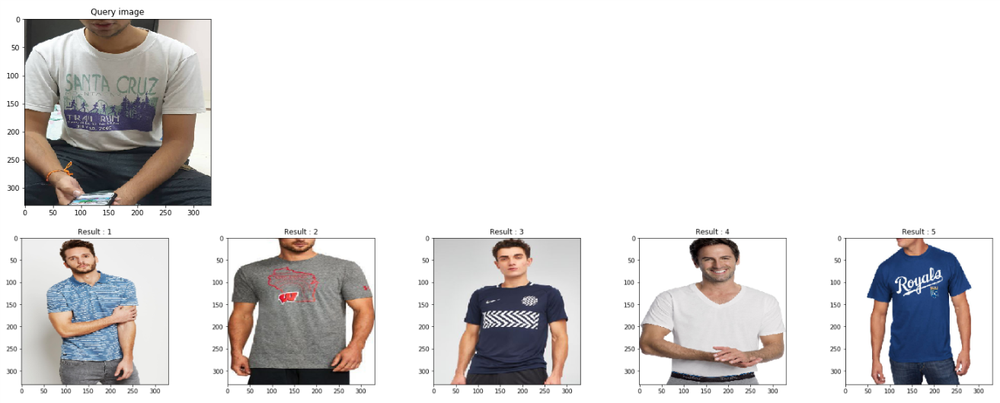
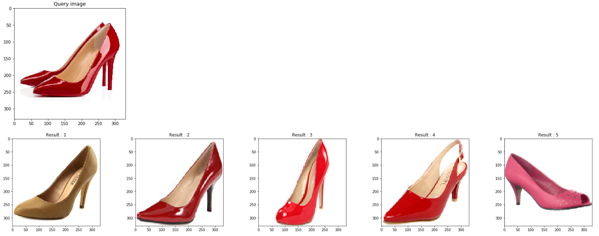

# Reverse Imange Search using DCNN and FAISS
 - The final dense layer (classifcation layer) of the Xception Network is removed.
 - The vector representation of the input image can be then got by passing the image through the network and taking the output of the Global Average Pooling layer.
 - The features of all the images in the dataset are precomputed and stored for fast searching.
 - Once the query image is input, the newly generated feature vector is then used to compute the L2 distances with respect to all the vectors computed from the image dataset.
 - The indices of top 5 vectors with least L2 are returned which is then used to pull images from the dataset
___
## Results
 - 
 ___
 - 
 ___
 - 
 ___
 - 
